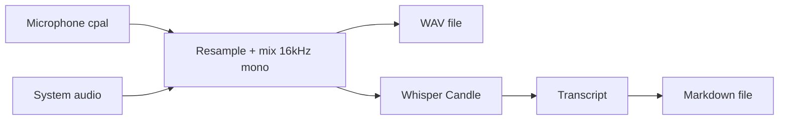

# Active Listener

Record meetings — **fully local**. Each **`start`** session saves a **16 kHz mono WAV**, then runs **Whisper** and writes **markdown** (via [Candle](https://github.com/huggingface/candle)).

## Why it's useful

- **Privacy**: audio and transcripts stay on your machine; no cloud ASR required.
- **Works with any call app**: choose sources with **`--mic`**, **`--system-audio`**, or both (e.g. `active-listener start --mic --system-audio`). System audio uses **macOS** (ScreenCaptureKit), **Windows** (WASAPI loopback), or **Linux** with **PipeWire** only (no PulseAudio fallback).

## Quick start

```bash
just install
```

Or without [just](https://github.com/casey/just):

```bash
cargo build --release
./target/release/active-listener install
```

After install, the binary is in `~/.local/bin`, zsh completions are configured, and the default Whisper weights (**`small`**) are downloaded from Hugging Face (use `active-listener install --whisper-model tiny` etc. to pick another size). When built with **`diarize`** (the default), **`install`** also downloads sherpa-onnx diarization assets (pyannote segmentation + **NeMo Titanet large** embedding) into `~/.cache/active-listener/diarize/`, so the first recording does not wait on those. Run `source ~/.zshrc` once.

To remove the installed binary, the install-time `~/.zshrc` snippets, and **all** cached `openai/whisper-*` Hugging Face hub folders:

```bash
active-listener uninstall
```

## Basic usage

```bash
# Interactive source pick (TTY): choose mic, system audio, or both — or pass flags explicitly
active-listener start

# Record until Ctrl+C; writes ./YYYY-MM-DD_HHMMSS.wav and .md (pass --mic and/or --system-audio)
active-listener start --mic --system-audio

active-listener start --mic --dir .
active-listener start --mic --system-audio --dir ~/notes --name standup
active-listener start --mic --whisper-model tiny --cpu

# Speaker labels: on by default after recording (default `cargo build` includes diarization)
./target/release/active-listener start --mic --no-diarize   # skip labels
./target/release/active-listener start --mic --num-speakers 3
# Smaller binary without ONNX diarization, e.g.: cargo build --release --no-default-features --features metal,linux-system-audio
```

Shell completions:

```bash
active-listener completions zsh   # also: bash, fish
# e.g. in ~/.zshrc: source <(active-listener completions zsh)
```

## How it works



**Speaker diarization** (sherpa-onnx, included in default builds) runs after recording on the same 16 kHz samples as Whisper, in parallel with transcription; use **`--no-diarize`** to skip it. Labels are merged into the transcript section of the markdown by overlapping timestamps.

1. **Capture** microphone and, when enabled, system audio (each resampled to 16 kHz mono, summed with soft clipping).
2. Write that mix as a **WAV** (same basename as the markdown file, `.wav` extension).
3. **Diarize** by default (opt out with `--no-diarize`) using sherpa-onnx models downloaded once from GitHub (segmentation tarball + NeMo Titanet **large** embedding, on the order of ~100 MB total for the default embedding), running **in parallel** with Whisper on the same audio. **Transcribe** with Whisper (default checkpoint **`small`**; weights from Hugging Face / `hf-hub` on first use), then write **markdown** with frontmatter and transcript; speaker headings are merged into the transcript by timestamp overlap.

## Security & privacy

- Processing is **local**. No audio, transcript, or notes are sent to third parties by this app.
- **Whisper weights** are downloaded once from Hugging Face (metadata only over the network; **no audio** is uploaded).
- **Diarization** (default-on after recording unless `--no-diarize`; omit the `diarize` feature when building for a smaller binary): ONNX models are downloaded once from **GitHub** (sherpa-onnx releases) into `~/.cache/active-listener/diarize/`; **no audio** is uploaded. Labels are `Speaker 1`, `Speaker 2`, … (not real names).
- **`active-listener uninstall`** removes **`~/.local/bin/active-listener`**, matching **`install`** snippets from **`~/.zshrc`**, and every **`openai/whisper-*`** directory under your Hugging Face hub cache.
- **`active-listener install`** caches the chosen Whisper model (default **`small`**) and, with default features, sherpa-onnx diarization models under **`~/.cache/active-listener/diarize/`**.
- Output **`.wav`** and **`.md`** contain raw audio / full transcript — protect them like any sensitive file.
- **Microphone** permission is required by macOS when recording.
- **Screen Recording** permission is required on macOS for system audio (System Settings → Privacy & Security).
- **Linux**: PipeWire must be running. Native builds use the default `linux-system-audio` feature and need `libpipewire-0.3-dev` and `libspa-0.2-dev`. **Cross-compiled** Linux binaries from `just build-cross` use `--no-default-features` (no PipeWire, no diarization); build on Ubuntu 22.04+ with default features for full Linux system audio and speaker labels.
- **Windows**: WASAPI loopback works on a normal desktop session. **Cross-compiled** Windows binaries from `just build-cross` use `--no-default-features` (no diarization); build natively with default features for speaker labels. Cross-compiling may require a toolchain with Windows SDK headers—build natively on Windows if `cross` fails.

## Speaker diarization quality

Offline diarization is **inherently fuzzy**: a single scalar threshold cannot separate “split one voice into two” vs “merge two people into one” in every room. Practical levers (all on `start` and `process`):

1. **`--num-speakers N`** when you know the count (e.g. two-person call). This fixes the cluster size and usually behaves better than threshold-only mode.
2. **`--diarize-threshold`** — coarse merge/split knob when `--num-speakers` is **not** set (higher → fewer speakers).
3. **`--diarize-min-duration-on`** / **`--diarize-min-duration-off`** — sherpa-onnx segment cleanup (defaults `0.3` / `0.5` seconds). Slightly **higher** `min-duration-off` can smooth rapid speaker flips; **higher** `min-duration-on` drops very short regions (can remove noise or clip short words if pushed too far).
4. **`--diarize-embedding`** (or env **`ACTIVE_LISTENER_DIARIZE_EMBEDDING`**) — path to a different 16 kHz speaker embedding ONNX. Default is NeMo **Titanet large** (auto-downloaded). Other models from [sherpa-onnx speaker-recongition-models](https://github.com/k2-fsa/sherpa-onnx/releases/tag/speaker-recongition-models) work via this flag if you want to experiment.

For difficult audio (TV in the room, heavy reverb, single mixed channel), expect imperfect labels; there is no second-stage “smart” relabeling in this app today.

## CLI options

Run `active-listener --help` for subcommands, or `active-listener start --help` for recording flags (colors, examples).

Notable `start` / `process` flags: **`--mic`**, **`--system-audio`** (at least one required for `start`), **`--no-diarize`**, diarization group (**`--num-speakers`**, **`--diarize-threshold`**, **`--diarize-min-duration-on`**, **`--diarize-min-duration-off`**, **`--diarize-embedding`** / **`ACTIVE_LISTENER_DIARIZE_EMBEDDING`**), `--dir`, `--name`, `--whisper-model` (default **`small`**), `--duration`, `--device` (mic only), `--list-devices`, `--verbose`, `--cpu`.

## Development

Requires [just](https://github.com/casey/just) (`brew install just`) and Rust 1.74+.

```bash
just build        # cargo build --release (native host)
just install      # build + active-listener install (copies binary, configures shell)
just build-cross  # macOS aarch64/x86_64 (Metal), Linux x86_64, Windows x86_64 GNU (CPU for non-macOS); needs Docker
just release      # build-cross + GitHub release (needs `gh`)
```

`just build-cross` requires [Docker](https://docs.docker.com/get-docker/) running and may install `cross` from git on first use (see [`scripts/build-cross.sh`](scripts/build-cross.sh)). For native development only, use `just build`. To try recording from a dev build: `cargo run -- start --mic` (writes WAV then markdown).

If you see `rustup: command not found`, ensure `~/.cargo/bin` is on your PATH (`scripts/build-cross.sh` prepends it; use a normal user `HOME`).

Cross-build logic also lives in [`scripts/build-cross.sh`](scripts/build-cross.sh); release packaging in [`scripts/release.sh`](scripts/release.sh) (invoked by `just`).

## Requirements

- Rust 1.74+
- macOS recommended for Metal (`metal` is a default feature). On other platforms use `cargo build --no-default-features` and enable the features you need (e.g. `diarize`, `linux-system-audio`) if Metal is unavailable or you are trimming the binary.

## License

Whisper decoding logic is adapted from the [candle-examples](https://github.com/huggingface/candle) Whisper example (same license as upstream Candle).
