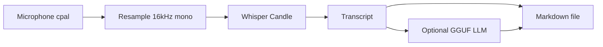

# Active Listener

Record meetings, get markdown notes — **fully local** (Whisper + optional GGUF LLM via [Candle](https://github.com/huggingface/candle)).

## Why it's useful

- **Privacy**: audio and transcripts stay on your machine; no cloud ASR required.
- **Works with any call app** as long as your mic picks you up (system-audio capture is not shipped in this build — use a virtual loopback device if you need desktop audio).
- **Optional summaries**: point at a Llama-compatible **GGUF** you already have; nothing is downloaded for the LLM.

## Quick start

```bash
just install
```

Or without [just](https://github.com/casey/just):

```bash
cargo build --release
./target/release/active-listener install
```

After install, the binary is in `~/.local/bin`, zsh completions are configured, and the default Whisper weights are downloaded from Hugging Face (use `active-listener install --whisper-model tiny` etc. to pick another size). Run `source ~/.zshrc` once.

## Basic usage

```bash
# Record until Ctrl+C; writes ./YYYY-MM-DD_HHMMSS.md (defaults: current directory, medium Whisper)
active-listener start

active-listener start --dir .
active-listener start --dir ~/notes --name standup
active-listener start --whisper-model tiny --cpu
active-listener start --llm-model ~/models/mistral-q4.gguf   # needs tokenizer.json beside the .gguf
```

Shell completions:

```bash
active-listener completions zsh   # also: bash, fish
# e.g. in ~/.zshrc: source <(active-listener completions zsh)
```

## How it works



1. **Capture** microphone (f32 → linear resample to 16 kHz mono).
2. **Transcribe** with OpenAI Whisper weights from Hugging Face (`hf-hub` cache, first run only).
3. **Summarize** (optional): load `quantized_llama`-compatible GGUF + `tokenizer.json` next to it.
4. **Write** YAML frontmatter + optional LLM body + timestamped transcript.

## Security & privacy

- Processing is **local**. No audio, transcript, or notes are sent to third parties by this app.
- **Whisper weights** are downloaded once from Hugging Face (metadata only over the network; **no audio** is uploaded).
- **LLM**: only reads files you pass; runs in-process. Place `tokenizer.json` next to your `.gguf` (e.g. copy from the model repo or LM Studio export).
- Output `.md` contains the full transcript — protect it like any sensitive file.
- **Microphone** permission is required by macOS when recording.

## CLI options

Run `active-listener --help` for subcommands, or `active-listener start --help` for recording flags (colors, examples).

Notable `start` flags: `--dir`, `--name`, `--whisper-model`, `--llm-model` / `ACTIVE_LISTENER_LLM_MODEL`, `--duration`, `--device`, `--list-devices`, `--verbose`, `--cpu`, `--mode batch|realtime` (realtime currently records then transcribes; live chunk decode is not implemented yet).

## Development

Requires [just](https://github.com/casey/just) (`brew install just`) and Rust 1.74+.

```bash
just build        # cargo build --release (native host)
just install      # build + active-listener install (copies binary, configures shell)
just build-cross  # macOS aarch64/x86_64 (Metal), Linux x86_64, Windows x86_64 GNU (CPU for non-macOS); needs Docker
just release      # build-cross + GitHub release (needs `gh`)
```

`just build-cross` requires [Docker](https://docs.docker.com/get-docker/) running and may install `cross` from git on first use (see [`scripts/build-cross.sh`](scripts/build-cross.sh)). For native development only, use `just build`. To try recording from a dev build: `cargo run -- start` or `cargo run -- start --dir .`.

If you see `rustup: command not found`, ensure `~/.cargo/bin` is on your PATH (`scripts/build-cross.sh` prepends it; use a normal user `HOME`).

Cross-build logic also lives in [`scripts/build-cross.sh`](scripts/build-cross.sh); release packaging in [`scripts/release.sh`](scripts/release.sh) (invoked by `just`).

## Requirements

- Rust 1.74+
- macOS recommended for Metal (`--features metal` is default). On other platforms use `cargo build --no-default-features` if Metal is unavailable.

## License

Whisper decoding logic is adapted from the [candle-examples](https://github.com/huggingface/candle) Whisper example (same license as upstream Candle).
